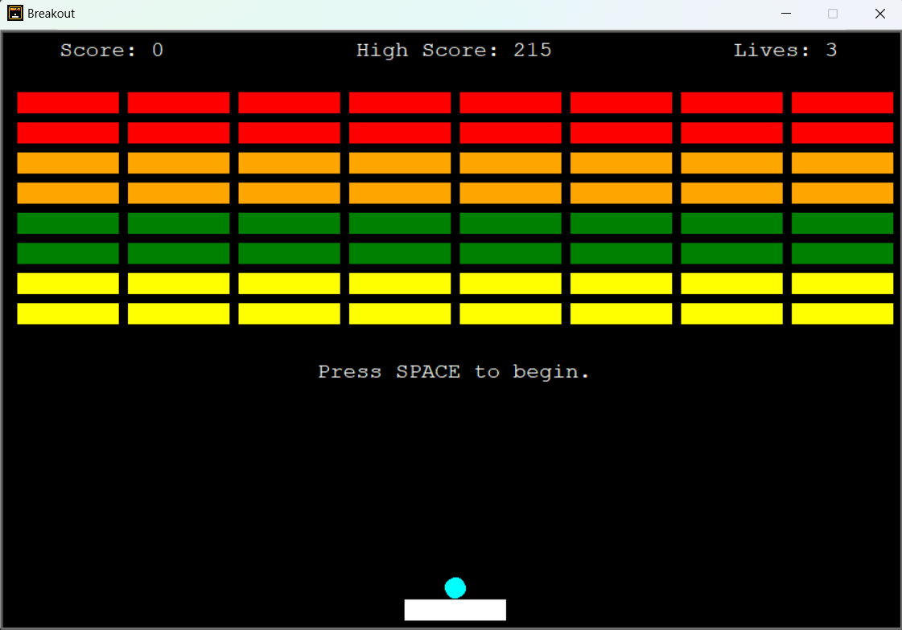
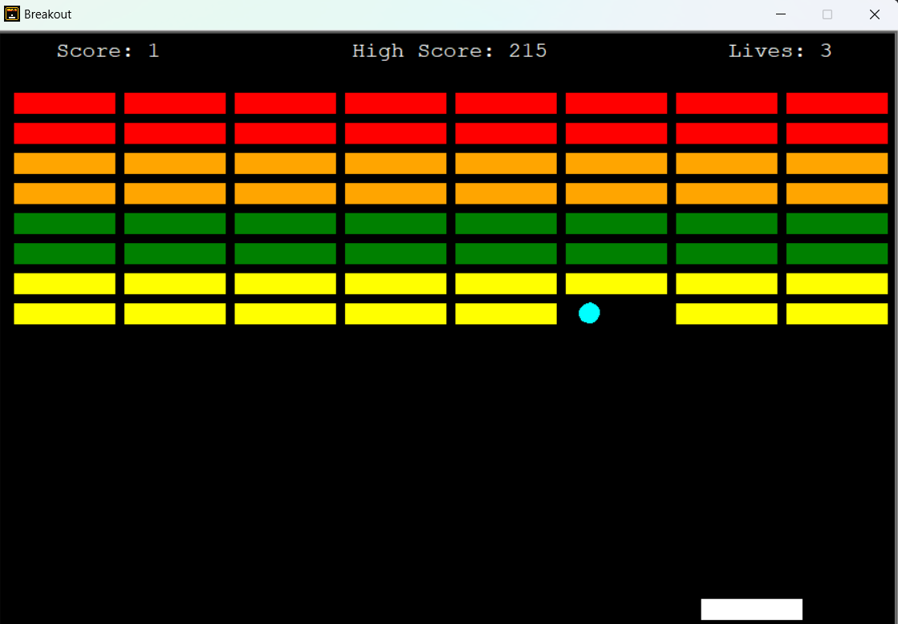
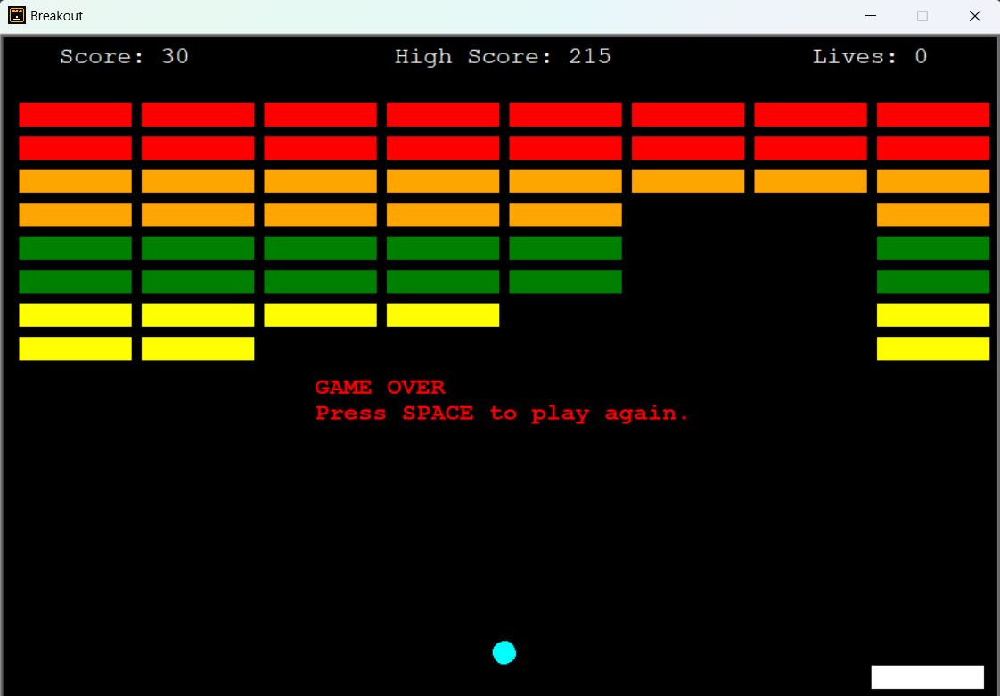
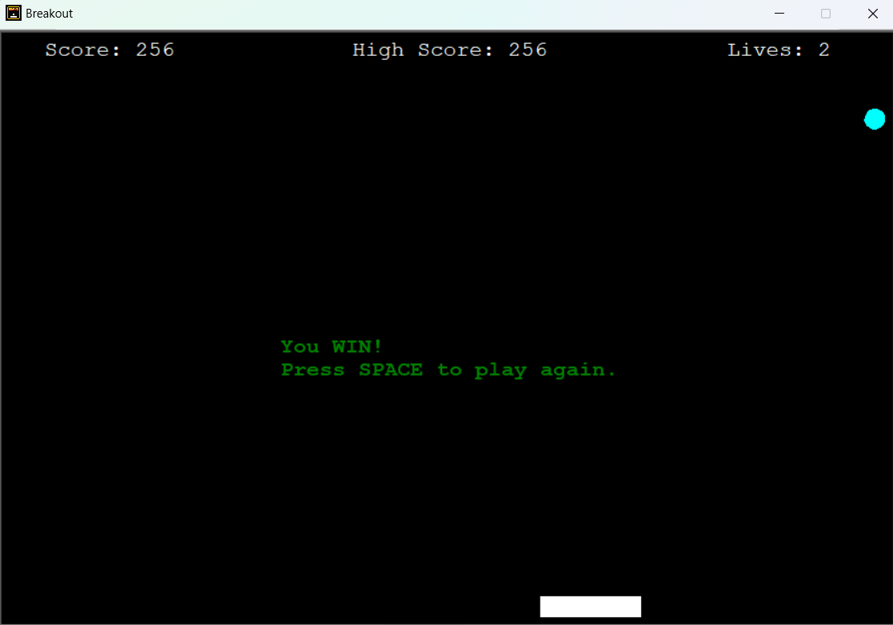

# Installation Instructions
To be able to run the game, run 'setup.py' once to install the required dependencies.

Next, all you have to do is run 'main.pyw' to launch the game!

# Game Features
This game is mainly made with the Turtle library of Python.

Sound effects are added with the Pygame library.

This game is very similar to the classic 1970s Breakout arcade game.

You move the paddle left and right by "a" and "d" or the left and right arrows.

When the ball hits the paddle, it automatically bounces. The direction depends on the part of the paddle it hit.

The ceiling and side walls also make the ball bounce.

If a ball hits a brick, the brick breaks, and your score increases by a specific amount, depending on the brick value.

The higher up the screen the brick, the greater its value.

Your highscores are saved and retrieved from the file called 'highscore.txt'.

If the ball misses your paddle, you lose 1 life. If your lives drop to 0, you lose.

If you clear all bricks, you win.

For simplicity, the game has no "levels" or power-ups. This closely mimics the original 1970s game.

# Game Screenshots
Start Screen:

Middle Game Screen:

Game Loss Screen:

Game Win Screen:

# Final Thoughts

Feel free to suggest any improvements!

Have fun!

If you would like to support me, you can [donate here](https://www.paypal.me/codingdromar).

